# Dimanche 26

### Passage à Nyons

Autoroute A7 **sortie 18**, passage à Nyons, puis Vaison: 2h22 (au lieu de 2h sans passer par Nyons)
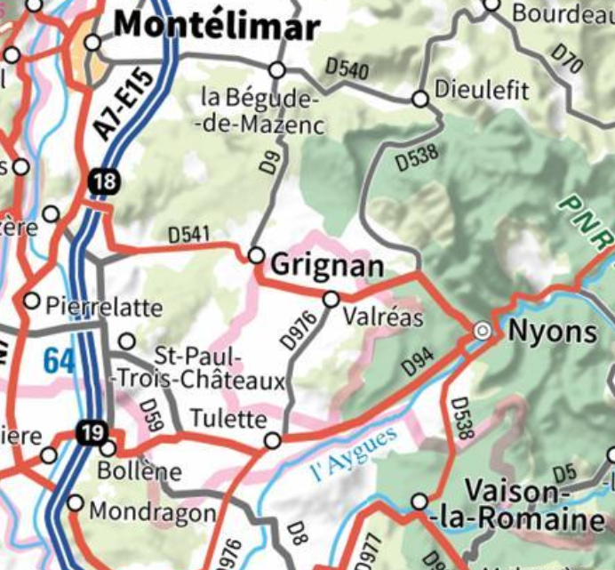

Passage à Nyons: se garer au bord de la rivière vers le pont romain pour trouver de l'huile d'olive (prendre de l'huile d'olive pour Tonton et pour Tullins si on en veut pour nous).
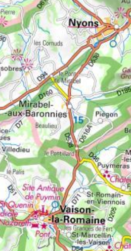

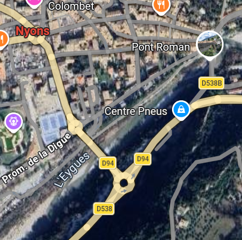

### Arrivée à Vaison

[Camping du théatre romain](https://www.camping-theatre.com/) (205 Chemin du Brusquet): arrivée avant 19h (tel: [04 90 28 78 66](tel:0033490287866))
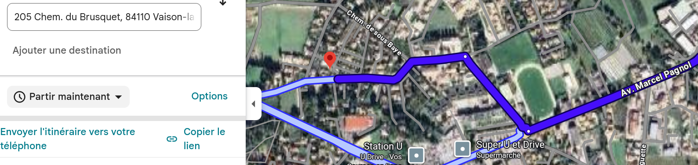

[Office du tourisme](https://www.vaison-la-romaine.com/tourisme/venir-vaison/office-tourisme/) de Vaison (plan, quoi faire après visite, ou manger le soir - tel: 0490365000):
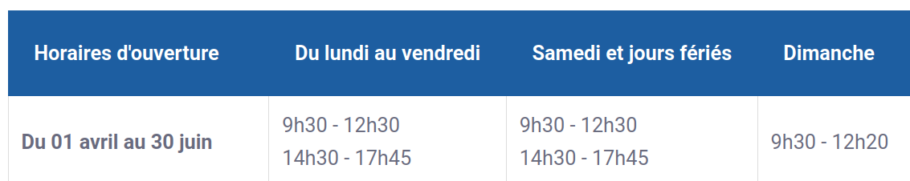

# Lundi 27

### Visite du site romain et du musée

Passage à l'[office du tourisme](https://www.vaison-la-romaine.com/tourisme/venir-vaison/office-tourisme/) si pas eu le temps à l'arrivée (demander quoi faire après visite site romain), tel: 0490365000:

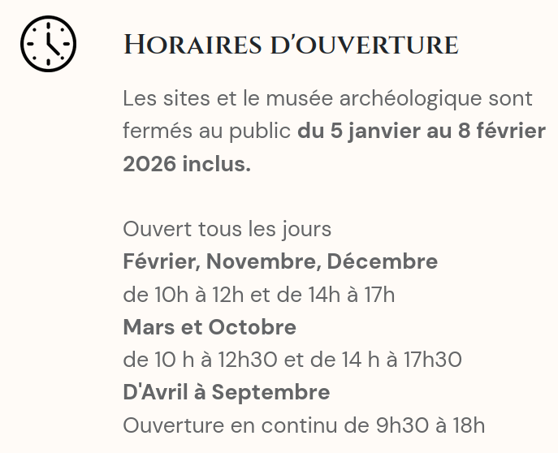

Il y a plusieurs sites:
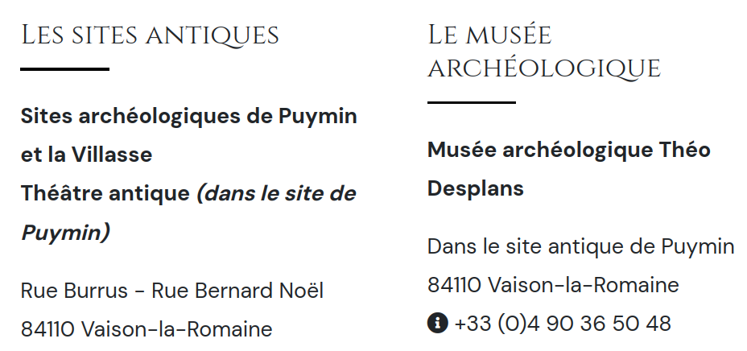

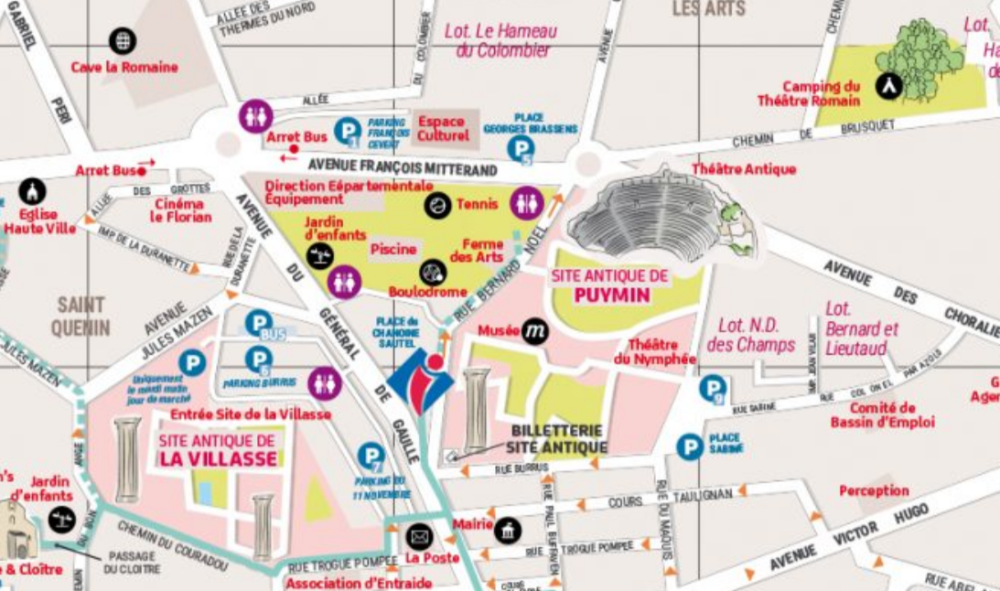

Le musée est sur le site de Puymin.

Autres choses le restant de la journée? Voir à l'office du tourisme.

# Mardi 28: Abbaye de Sénanque

### Passage à Baume de Venise

On va à L'abbaye de Sénanque: 1h
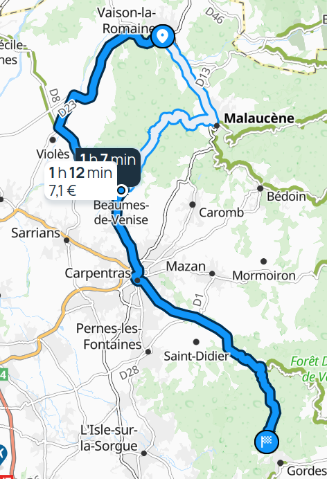

Sur le passage aller à la [cave coopérative](https://rhonea.fr) de Baume de Venise (Rhonéa):
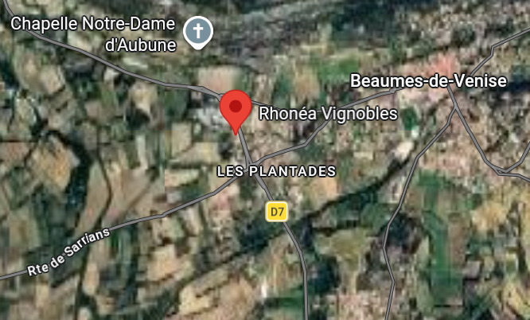

- 3 Gigondas (rouge), 3 Baume de Venise (rouge), 2 Blancs le reste en rouge fruité et pas âpre pour Tonton:
  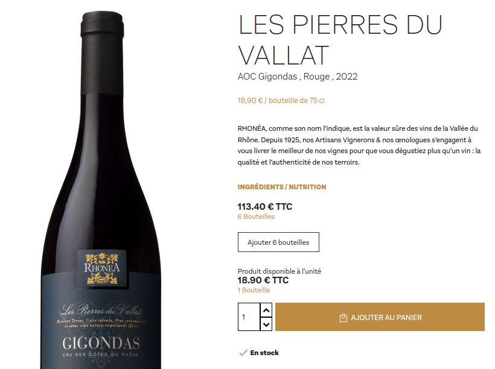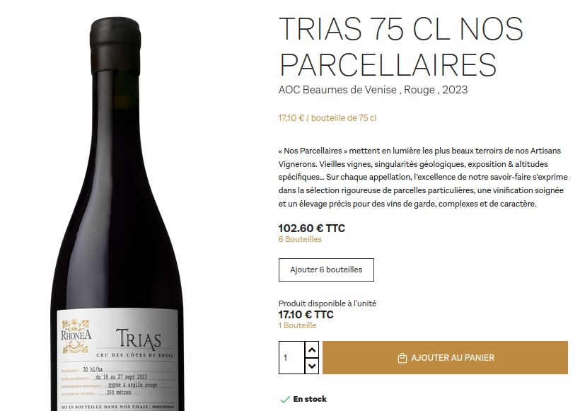
  
  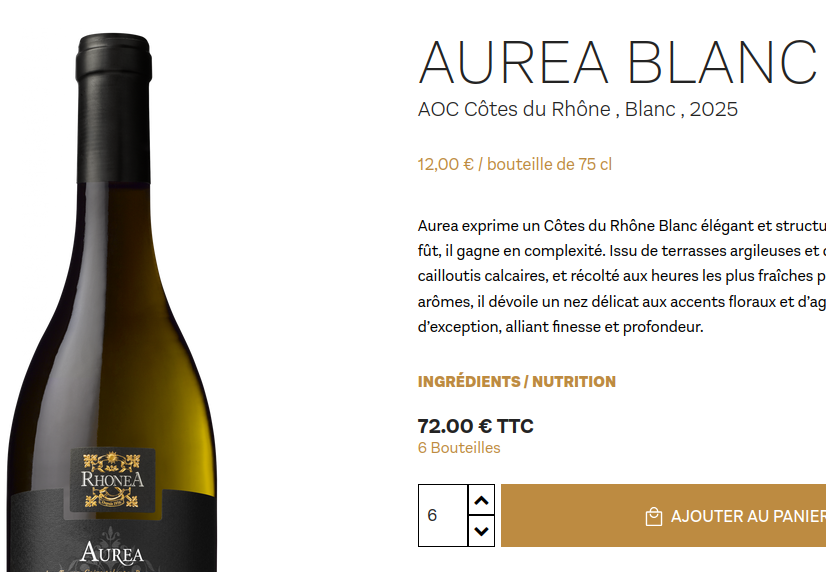
  
- Un carton de muscat de Baume de Venise pour mes parents:
  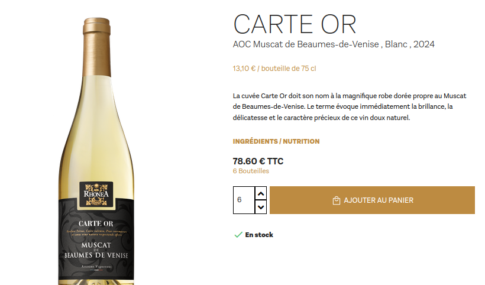

### Abbaye de Sénanque

On vise [l'abbaye](https://www.senanque.fr/) la visite guidée de 13h30

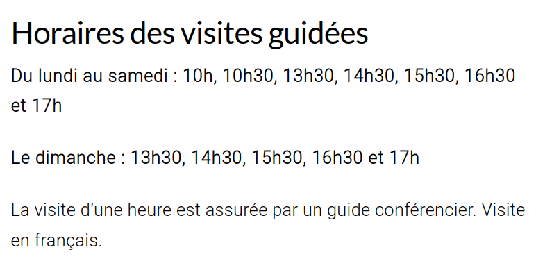

### Camping La Sorguette

Le soir au [camping de la Sorguette](https://www.camping-sorguette.com/) à L'isle sur la Sorgue: appeler [04 90 38 05 71](tel:0490380571) si arrivée après 18h

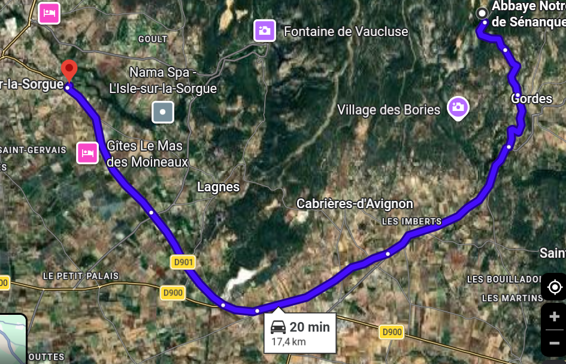

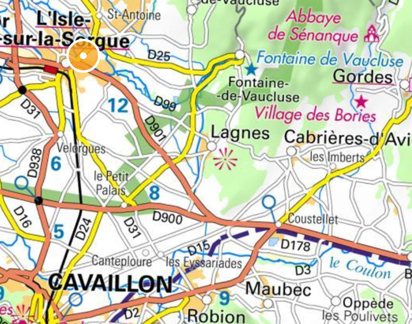

Le camping est à l'entrée de la ville:
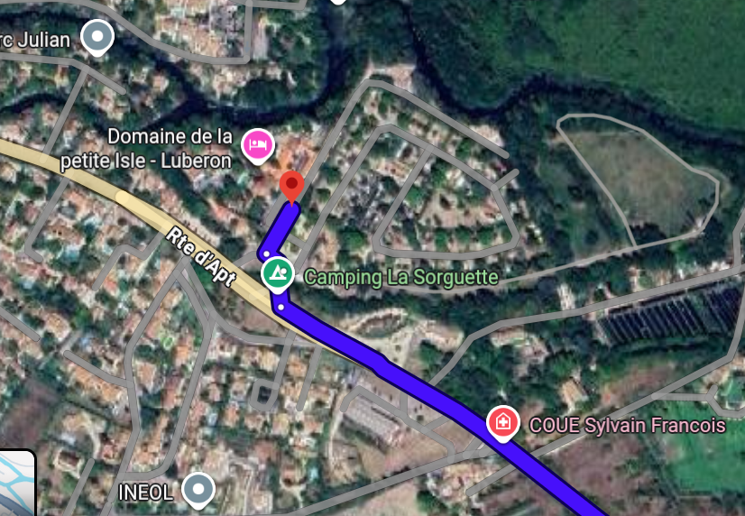

Plan:
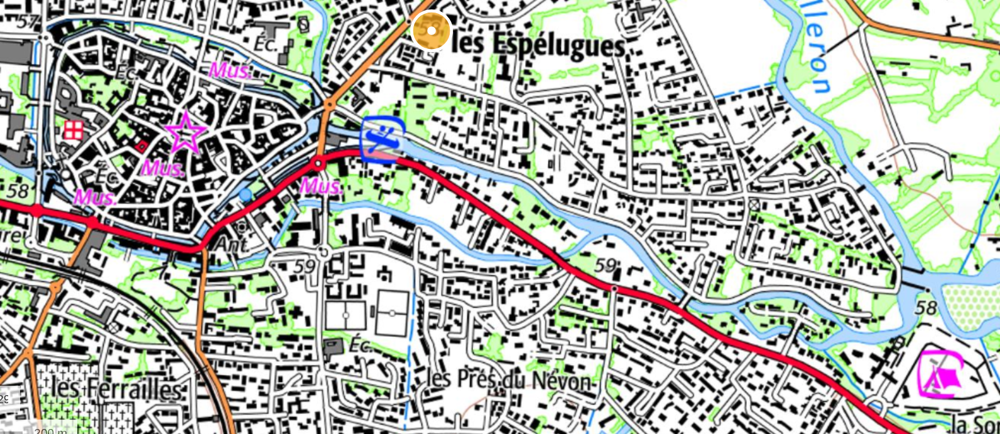

[Office du tourisme](https://islesurlasorguetourisme.com/), tel 04 90 38 04 78 :
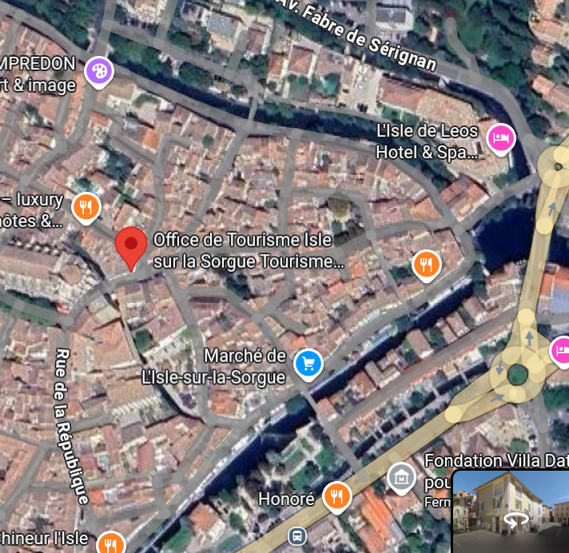
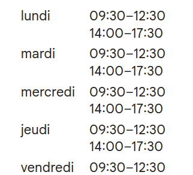

# Mercredi 29: Retour en passant par Forcalquier

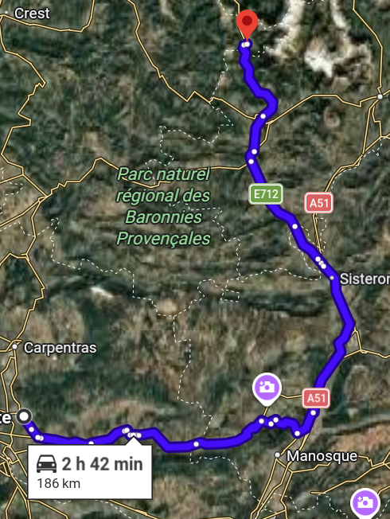

En gros 3h de trajet.

On peut s'arrêter prendre le café à Forcalquier et faire le PicNic au col de Lus la Croix Haute.

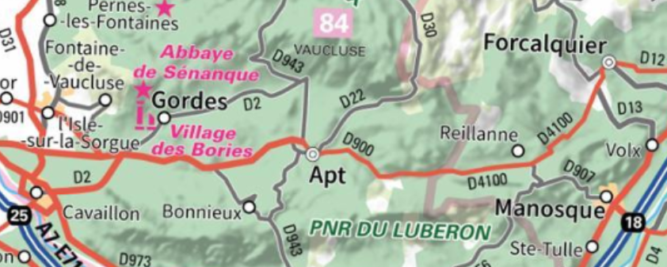
Route D900 vers Forcalquier dans le Lubéron.

On prend ensuite l'autoroute jusqu'à Sisteron:
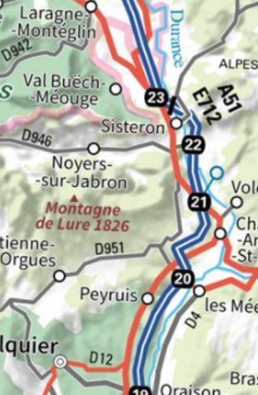
On suit ainsi la Durance

Ensuite on met le cap vers le Col de la croix haute:
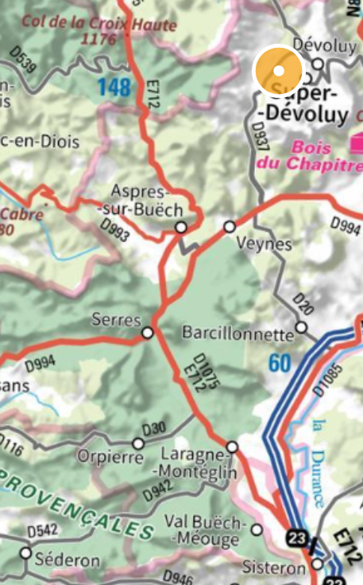
On passe ainsi dans le Buëch avec les Barronies main gauche.
On croise la route D994 qui remonte de Nyons (à Serres) et ensuite la D993 qui nous rejoints à Aspres-sur-Buëch.

Ensuite Grenoble:
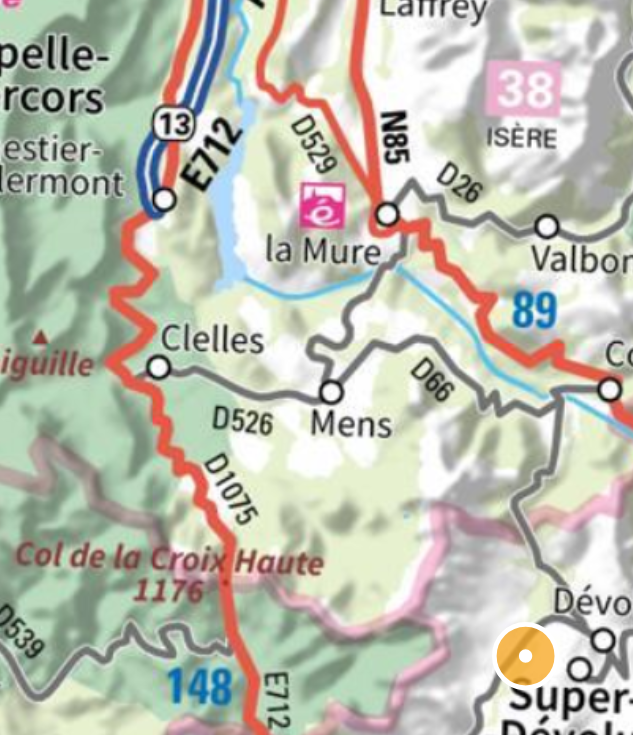
